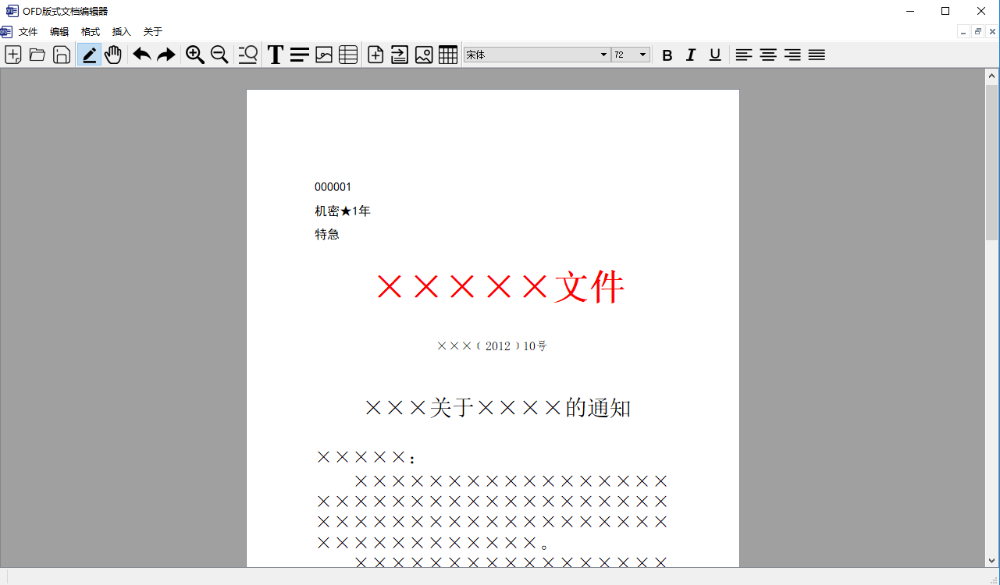
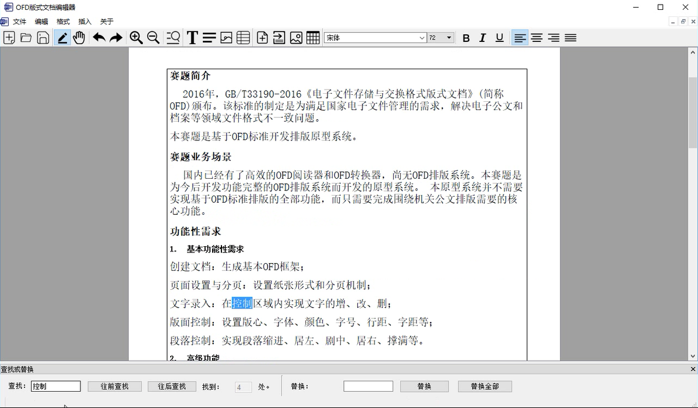

# ofdEditor
# 注意！
这个工程是之前参加2017年中软杯时的赛题，实际上很不完善，本人也不暂不考虑进行后续的完善和开发了。

## 开发环境（实时更新）
 ~~Qt5.8 + msvc2015~~
```
win32 : Qt 4.8.6 + MinGW 4.8.2
中标麒麟 6.0 : Qt 4.8.6 + Gcc 4.8.3
```

## 目标运行环境
`windows 10 ` `ubuntu 16.04` `中标麒麟6.0`

## 功能需求

1. 创建文档
>创建文当是本系统的最基本的功能，即新建一个OFD类型的文档。新建的文档应该是一个只有页空白页的，默认纸张大小、默认页边距的文档。
为了方便用户使用，在创建OFD文档时，应考虑增加几个常用板式模板。这样比如用户，创建完成后，只需要简单的改改自己需要的部分即可。

2. 页面设置与分页
>页面设置与分页也是比较常用的功能，它要做的是设置纸张的大小与形式，之后再设置纸张的分页机制。本系统在实现时，应该设置到能够快速切换到常用纸张大小，比如：A3、A4、A5等纸张大小。

3. 文字录入
>文字录入功能可以说是OFD文档原型系统必须实现的功能。本系统需要实现的是如同记事本一样非常自然的输入方式，让用户能够录入文字后立马看到效果，并且要能够做到在通用的OFD阅读器上打开也具有同样的效果。

4. 版面控制
>版面控制需要实现设置版心、字体、颜色、字号、行距、字距等功能，这些功能都是版面布局时所需要的。同样，版面控制的效果需要在所有的OFD阅读器上都能够看到。

5.	图像控制
>图像控制功能，即实现插入图片，设置常用的文字环绕方式。这里我们需要能够设置图片的尺寸，长宽比；需要设置文字环绕方式为包围式、嵌入文本行中等。

6.	表格编辑
>表格编辑功能，需要能够插入表格，在表格中调节文字排版。并且，插入表格时要能够设置表格的行列数量，在后面也要能够对表格的单元格进行大小调整，分离或合并不同单元格。

7.	撤销恢复功能
>用户在操作中常常遇到需要撤销恢复的情况，为此需要设置撤销恢复功能，最好撤销恢复次数需要大于10次。撤销恢复的功能目前可以说是商用编辑软件的必备功能了。

8.	查找替换功能
>用户在编辑文档时，当文档过于长时，需要用查找功能查询到某处关键字，或者是需要进行关键词的批量替换。

9.	视图缩放功能
>有的用户可能会嫌弃页面显示的内容太小；有的用户会觉得应用内容文字过大；而有的用户需要快速的浏览文档的内容。为此，系统需要包含浏览视图的放大缩小功能。此功能能够方便用户浏览，为用户的使用提供很大的便利性。


## 工程布局（实时更新）
本工程将采用Qt 多工程组织的形式，将按文件功能将代码文件分为若干个不同的子工程。<br>
子工程主要分为两个类型`app`和`lib`，`app`类型为可执行文件，`lib`类型为库文件。

```
|-model     -> 系统工作时的数据模型及显示渲染
|-ofd       -> ofd，主要用与ofd文件读取导出，以及ofd读取初期所使用的数据结构
|-start     -> start，程序的启动工程，存放关于主界面相关的

```

## 软件效果图




## 工程引用外部库
工程引用了 `quazip 0.73`作为本工程的zip压缩工具，他人在编译本工程时，请预先配置好`quazip 0.73` 的环境，之后才可以正常编译本工程。

## 翻译文件
本系统编写时设置语言为英文。在`model`和`start`工程下设置了翻译文件。
```
\ofdEditor
  \-model
   \-cn_model.ts
  \-start
   \-cn_start.ts
```
编译时，使用Qt自带的Linguist程序生成relesae的翻译文件，放在编译完成的bin目录下。

[QuaZip官网](http://quazip.sourceforge.net/)
